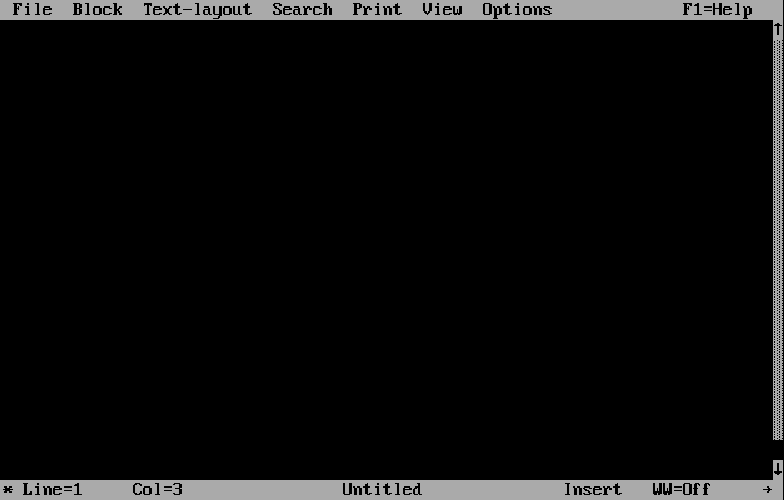

# NortonEditor-Web
Created using JS-DOS v8 Builder

What is Norton Editor?
===================

- It is a text editor for MS-DOS, developed by Peter Norton.
- Norton Editor is a popular editor for DOS, known for its simplicity and ease of use.
- It is often used to edit configuration files, batch files, and other plain text files in the DOS environment.

System Requirements
====================
- A modern-ish browser with Javascript and WebAssembly enabled

State
=====
- WIP/POC
- [Demo](https://sounddrill31.github.io/NortonEditor-Web)

Credits
=======
- Based on the [JS Dos Project](https://js-dos.com), built using their Web Builder

Issues ?
========
Quotes, +, ~ not working
Report them [here](https://github.com/sounddrill31/NortonEditor-Web/issues)